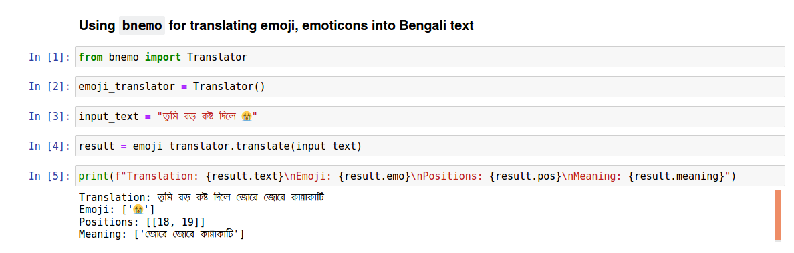

# bnemo
----------------------------------------------
#### A Python package for translating Emoji and Emoticons into Bengali text.
-----------------------------------------------



## Background
<p align= "justify">
Normally text corpus or text data contains different type of emoji, emoticons to express emotions and sentiment, specially text collected from social media. But this emojis have hardly any meaning in terms of text analysis if those are not converted into corresponding text. From that observation, we are trying to build a database of translation for common emoji, emoticons in Bengali so that Bengali NLP practitionars can use this database to translate emoji, emoticons into Bengali pharases for better understanding of text data. As the initial step, we have created this python package to easily use the emoji, emoticons to Bengali text database in NLP task.
</p>

--------------------------------------------------


## Installation
Install using the following command - 
```bash
pip install bnemo
```

Uninstall using the following command - 
```bash
pip uninstall bnemo
```

## Getting Started

To use ```bnemo``` install it using ```pip```. And make sure you have the required python version in your environment, i.e. ```python >= 3.5```.

#### Step#1: 
Import the ```Translator``` class from ```bnemo``` module.
```python
from bnemo import Translator
```

#### Step#2:
Create an instance of ```Translator``` class.
```python
translator = Translator()
```

#### Step#3:
Use the ```translate()``` method of ```Translator``` class to translate any emoji, emoticons in your Bengali text data.
```python
input_text = "তুমি বড় কষ্ট দিলে 😭"
result = translator.translate(input_text)
```

#### Step#4:
It will return a ```Result``` object, that has four attributes.

| Attribute | Data Type | Explanation |
|-----------|-----------|-------------|
| text      |  String   | This is the translated text from bnemo |
| emo       |  List     | List of all the emoji, emoticons in the given input text | 
| pos       |  List of list  | This is the list of start and ending index of each emoji in the input text |
| meaning   |  List of Strings  |  This is the list of meanings for each emoji, emoticons in the input text |


#### Step#5:
If you follow the above steps you might get the output as bellow - 
```python
print(f"Translation: {result.text}\nEmoji: {result.emo}\nPositions: {result.pos}\nMeaning: {result.meaning}")
```
Output:
```bash
Translation: তুমি বড় কষ্ট দিলে জোরে জোরে কান্নাকাটি
Emoji: ['😭']
Positions: [[18, 19]]
Meaning: ['জোরে জোরে কান্নাকাটি']
```

## How to Contribute
You can contribute in the following ways - 

- You can suggest better translation for any emoji, emoticons and send a pull request.
- You can create notebooks for showing use cases of this package or emoji database.
- Or may be in someother way not listed here


## Inspiration
- The package was inspired by the awesome tool that you can use for translating emoji, emoticons into english phrases. Check out this awesome tool as well.
[https://github.com/NeelShah18/emot](https://github.com/NeelShah18/emot/)

- List of unicode emojis
[https://unicode.org/emoji/charts/full-emoji-list.html](https://unicode.org/emoji/charts/full-emoji-list.html)